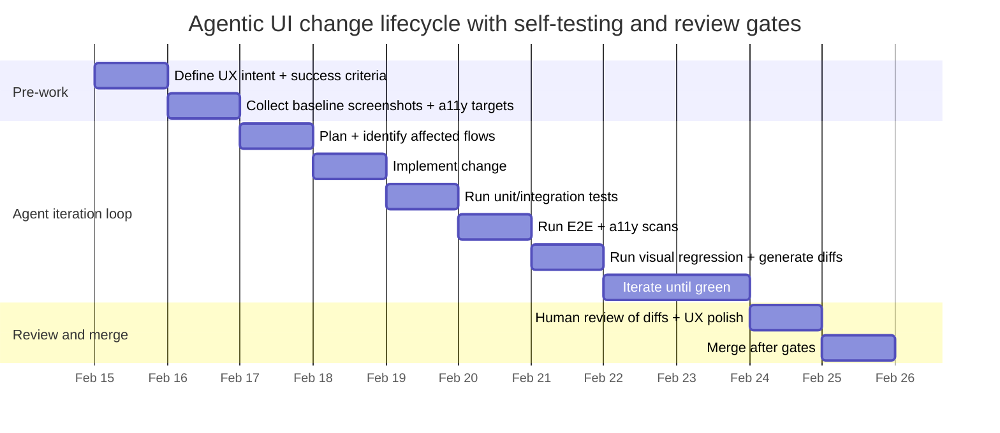

# End-to-End Agentic Development With Self-Testing for UI and UX in Claude Code and Peer Tools

## Executive summary

Agentic coding tools are most effective when they are embedded in a closed-loop development system that can **plan → implement → test → diagnose → iterate**, while producing auditable artifacts (diffs, logs, screenshots, traces) and respecting security boundaries (permissions, sandboxing, least privilege). citeturn14view0turn12view2turn11view1

A particularly high-leverage pattern—explicitly emphasized in Claude Code’s own best-practices guidance—is to **give the agent a way to verify its work** (tests, screenshots, expected outputs), because agents otherwise “look right” but fail in edge cases, and humans become the only feedback loop. citeturn12view2turn14view0 This matters even more for UI/UX changes, where correctness includes “looks good” and where regressions often slip through functional assertions. citeturn0search3turn5search3turn8search2

For UI/UX self-testing, the strongest practical best-practice stack is a **multi-oracle strategy**:

- **Deterministic oracles**: unit/integration tests, contract tests, E2E interaction assertions, accessibility rule checks, performance budgets. citeturn5search14turn5search0turn6search13turn9search5
- **Visual oracles**: automated screenshot diffing (component + page + key flows), with controlled baselines, masking of dynamic regions, and perceptual metrics when pixel-diffs are too fragile. citeturn0search3turn8search13turn8search0turn7search3
- **Judgment oracles** (carefully bounded): LLM-as-a-judge for _triage and prioritization_, paired with human-in-the-loop review for high-impact UX. This is useful, but must account for known judge biases and reliability issues. citeturn7search2turn7search10

Across tools, two converging platform patterns are becoming dominant:

1. **Local agentic IDE/CLI** workflows (fast iteration, rich context, but higher risk if permissions are broad). Claude Code explicitly supports an “agentic loop” and emphasizes verification; it also provides fine-grained permissions, sandboxing, hooks, skills, and subagents to modularize work and enforce checks. citeturn14view0turn11view2turn16view3turn12view1
2. **PR-native agents running in CI** (more auditable, more governable): for example, GitHub’s Copilot coding agent works in an ephemeral GitHub Actions-backed environment and iterates in PRs; Claude Code also provides GitHub Actions and GitLab CI integrations for event-driven PR/MR automation. citeturn17view3turn16view0turn16view1

Finally, governance is not optional: prompt injection and insecure tool use are first-class risks for agentic systems, so production-grade setups treat sandboxing, constrained networking, signed/provenanced builds, and supply-chain checks as default guardrails—not afterthoughts. citeturn11view1turn10search0turn10search2turn10search3

## Assumptions and scope

Because your request does not specify a product, UI framework, or deployment target, the report makes the following explicit assumptions (you can swap equivalents; the patterns are the point):

Assumptions about the product and stack:

- The “UI/UX” surface is primarily a **web UI** (desktop + mobile responsive), since mainstream visual regression and interaction automation stacks referenced by vendors are web-centric (e.g., Playwright/Cypress). citeturn6search19turn8search2
- Source control is **Git**, with change review performed via PR/MR. citeturn15search5turn17view3
- CI is one of: GitHub Actions or GitLab CI/CD (both have explicit integrations in Claude Code docs, and Copilot’s coding agent is GitHub Actions-powered). citeturn16view0turn16view1turn17view3
- The team can accept a workflow where “looks good” is enforced via **visual baselines** + review gates (Percy/Playwright snapshots/Applitools-like tools), not purely by unit tests. citeturn5search3turn0search3turn6search2

Assumptions about agent autonomy:

- Agents may propose and run tests, but merging requires a **human approval gate** (to manage security, correctness, and accountability). This aligns with common PR-native agent patterns and with documented governance restrictions for PR agents. citeturn17view3turn11view1

Scope boundaries:

- This report focuses on best practices for **agentic development flows**, **UI/UX self-testing**, and **operationalization** (CI/CD, artifacts, governance). It does not attempt to rank models; instead it treats the “agent harness” + “verification system” as the main reliability lever. citeturn14view0turn4search1

## Tool landscape and orchestration frameworks

Agentic coding systems are best understood as a layered stack:

- **Work surface**: terminal/IDE/PR comments where tasks are assigned and outputs inspected. citeturn0search0turn17view3
- **Agent harness**: tool execution, context management, permissions, checkpoints, and multi-step loops (this is where “agentic” lives). Claude Code explicitly describes this as an agent loop using tools to gather context, act, and verify. citeturn14view0turn12view2
- **Orchestration + tool connectivity**: standardized bridges to external tools/data (increasingly via MCP), plus multi-agent coordination frameworks when you need durable workflows and parallelism. citeturn0search5turn0search2turn3search0

### Claude Code as an end-to-end harness

Claude Code (from entity["company","Anthropic","ai company"]) is positioned as an “agentic coding tool” that can read a codebase, edit files, run commands, and integrate with dev tools across terminal/IDE/web/desktop. citeturn0search0turn15search12 Its documentation emphasizes an explicit **agentic loop**—gather context, take action, verify results—powered by tools for file ops, search, execution, and web lookup. citeturn14view0

Several primitives in Claude Code materially enable self-testing and governability:

- **Verification-first workflow guidance**: documentation calls giving Claude something to verify against (tests, screenshots, expected outputs) “the single highest-leverage thing,” including explicit mention of verifying UI changes by screenshot comparison and iteration. citeturn12view2turn14view0
- **Fine-grained permissions + sandboxing**: Claude Code defaults to read-only and requires explicit approval for commands/edits; permissions can be version-controlled and distributed org-wide, and sandboxing can reduce prompt fatigue while keeping boundaries. citeturn11view1turn11view2turn12view1
- **Hooks (deterministic enforcement)**: hooks run at lifecycle points to guarantee actions happen (formatting, validation, blocking risky actions), explicitly positioned as more reliable than “advisory” instruction files. citeturn16view3turn15search6turn13view1
- **Subagents and parallel sessions**: subagents isolate context; multiple sessions support writer–reviewer and code–test split patterns, which directly improves self-testing independence. citeturn13view2turn15search16
- **Programmatic execution via Agent SDK** (`claude -p`) for CI scripting and reproducible agent runs. citeturn16view2turn11view3

### Peer agentic coding tools and platforms

The landscape is converging toward two “agent placement” styles: **local agents** and **PR-native CI agents**.

- **PR-native agent example**: GitHub Copilot coding agent (from entity["company","GitHub","software development platform"], part of entity["company","Microsoft","technology company"]) runs tasks in an ephemeral environment powered by GitHub Actions, opens PRs, and supports iteration through PR comments; this shifts work into an auditable PR workflow rather than untracked local sessions. citeturn17view3turn9search7
- **Local IDE agent example**: Copilot “agent mode” in IDEs can autonomously choose files, propose terminal commands, and iterate until the task completes; GitHub explicitly notes agent mode is suited for multi-step, iterative tasks and can integrate with external tools (including MCP). citeturn18view1
- **Windsurf Cascade** (from entity["company","Codeium","ai coding company"]): an agentic assistant with tool calling, checkpoints/reverts, and linter integration, reflecting the same “edit → run tool → iterate” pattern inside an IDE. citeturn17view1
- **Aider**: a terminal-based pair-programming tool that emphasizes Git integration (automatic commits) and accepting images/web pages as context, which can be useful for UI bug screenshots and design references. citeturn2search3turn17view2turn2search5
- **Cursor**: vendor docs describe “rules” as system-level instructions bundling prompts/workflows for an agent (official page text is partially inaccessible in this crawl environment, so the report relies on the available snippet). citeturn2search1

### Orchestration and tool connectivity frameworks

A complete “agentic development flow” usually needs orchestration beyond a single interactive session:

- **Model Context Protocol (MCP)**: an open protocol aimed at standardizing integrations between LLM applications and external tools/data sources, with an authoritative spec and an ecosystem of MCP servers/clients. citeturn0search2turn0search5 Claude Code explicitly supports connecting MCP servers and describes using them to integrate issue trackers, databases, and design tools; GitHub Copilot also references MCP servers for extending agent capability. citeturn13view1turn17view3
- **LangGraph** (from entity["company","LangChain","llm tooling company"]): provides workflow/agent patterns with persistence (“durable execution”), which is useful when agentic runs span multiple CI jobs or need resumability and audit trails. citeturn3search0turn3search4
- **AutoGen and related research** (from entity["company","Microsoft Research","research organization"]): frames multi-agent conversations as an abstraction to combine LLMs, tools, and humans. citeturn3search1turn3search5
- **Agent-computer interface research**: SWE-agent shows that _interface design_—how an agent navigates repos, edits files, runs tests—strongly affects performance, reinforcing the importance of a well-designed harness and verification loop. citeturn4search1turn4search9

### Comparative table of agentic coding tools

| Tool / platform             | Where it runs                                              | Strengths for end-to-end flow                                                                                                                         | Built-in or first-class self-testing hooks                                                                                                      | Primary documentation sources                                                  |
| --------------------------- | ---------------------------------------------------------- | ----------------------------------------------------------------------------------------------------------------------------------------------------- | ----------------------------------------------------------------------------------------------------------------------------------------------- | ------------------------------------------------------------------------------ |
| Claude Code                 | Local terminal/IDE + web; also CI via SDK and integrations | Explicit agentic loop; strong emphasis on verification; fine-grained permissions + sandboxing; hooks/subagents/skills; integrations for PR automation | Docs explicitly recommend tests + screenshots; supports Chrome integration for UI checks; hooks enable deterministic “always run tests/linters” | citeturn14view0turn12view2turn11view2turn16view3turn16view0turn16view2 |
| GitHub Copilot coding agent | PR-native on GitHub, backed by GitHub Actions              | Auditable PR workflow; executes tests/linters; governance controls (branch restrictions, workflow approval)                                           | Runs tests/linters in ephemeral environment; security validations (e.g., CodeQL, dependency checks) described in docs                           | citeturn17view3turn9search7                                                |
| GitHub Copilot agent mode   | Local IDE                                                  | Autonomous multi-step edits; integrates with external tools such as MCP servers                                                                       | Iterative remediation described; actual verification depends on local test commands and project setup                                           | citeturn18view1                                                             |
| Windsurf Cascade            | Local IDE                                                  | Checkpoints/reverts; tool calling; linter integration; “plans/todo lists” affordances                                                                 | Leverages linter; other testing depends on configured toolchain                                                                                 | citeturn17view1turn2search12                                               |
| Aider                       | Terminal + Git workflow                                    | Git-first iteration; can attach images/web pages as context                                                                                           | Verification depends on prompts and local CI/test toolchain                                                                                     | citeturn17view2turn2search5                                                |
| Cursor rules system         | Local IDE                                                  | Rule-based instruction sharing for agent behavior (limited primary text available here)                                                               | Depends on integrated test runners; relies on user-defined rules/workflows                                                                      | citeturn2search1                                                            |

## Testing strategies for agentic development

A complete agentic flow needs a testing strategy that is both **composable** (agents can run it repeatedly) and **stable** (low flake, deterministic outputs), because agents learn from feedback signals and will burn budget thrashing on noisy tests. citeturn12view2turn9search4turn4search2

### Layered approach for UI/UX-heavy systems

A pragmatic “agent-friendly” stack typically has these layers:

- **Unit tests** for business logic and pure functions: fastest feedback; easiest for agents to generate and repair. (Foundational, widely accepted practice; the key agentic point is ensuring commands are documented in the repo context file so agents can run them consistently.) citeturn12view2turn13view0
- **Integration tests** for service boundaries, API contracts, and component composition (including component rendering with stable fixtures).
- **E2E interaction tests** for key flows (auth, checkout, settings): a browser automation framework that behaves like a user. citeturn8search7turn9search5
- **Visual regression tests** for UI correctness (“looks right”): screenshot comparisons for components and pages, ideally with review gates. citeturn0search3turn5search3turn8search2
- **Accessibility tests**: automated rule checks (axe) plus targeted manual audits; automated checks catch a meaningful subset but do not replace manual testing. citeturn5search14turn5search0turn5search11
- **Cross-browser/device coverage**: run E2E + visual tests across multiple engines/devices. Playwright supports multi-browser projects including Chromium/Firefox/WebKit and device emulation. citeturn6search19turn6search3
- **Performance budgets** and UX metrics: capture regressions early (Lighthouse CI / budgets) and track real-user metrics (Core Web Vitals: loading/interactivity/visual stability). citeturn6search0turn6search21turn6search13

### Key tools for UI/UX self-verification

A few test tools have particularly relevant affordances for agentic self-testing:

- **Playwright visual comparisons**: `toHaveScreenshot()` generates baseline snapshots on first run and diffs on subsequent runs; its screenshot assertion waits for stability across consecutive screenshots to reduce flakiness. citeturn0search3turn0search6
- **Playwright trace viewer**: record traces on CI retries (commonly on first retry) to produce rich artifacts for debugging failures without rerunning locally, which also helps agents “explain why it failed” from artifacts. citeturn9search4turn9search0
- **Storybook interaction tests**: execute component-level interactions in a real browser, keeping stories and tests together, improving both debuggability and agent reproducibility (agents can modify story + play function + assertions in one place). citeturn5search2turn5search9
- **Playwright accessibility testing**: official guidance shows integrating axe-based scans with Playwright tests, including selective rule disabling for incremental adoption. citeturn5search14turn5search5
- **Cypress visual testing**: Cypress documents visual testing via plugins for ensuring the UI “visually looks as intended,” as part of its broader test offerings. citeturn8search2
- **Percy workflow** (via entity["company","BrowserStack","testing platform"]): capture screenshots during test runs, highlight diffs, and require review/approval before merge—well aligned with “human-in-the-loop” for visual polish. citeturn5search3turn5search16
- **Applitools**: positions “Visual AI” and cross-browser/device grids as an alternative to strict pixel diffs, aiming to ignore insignificant differences and scale coverage. citeturn6search2turn6search6

### Comparative table of testing approaches for agentic systems

| Test type            | What it catches                               | Agentic advantages                                            | Common failure modes in agentic loops                      | Representative tools / docs                                                                                       |
| -------------------- | --------------------------------------------- | ------------------------------------------------------------- | ---------------------------------------------------------- | ----------------------------------------------------------------------------------------------------------------- |
| Unit                 | Logic regressions, edge cases                 | Fast feedback; easy for agents to generate and iterate        | Overfitting to implementation; brittle mocks               | (General best practice; ensure commands + examples are embedded in repo context) citeturn13view0turn12view2   |
| Integration          | Boundary mismatches, API contracts            | Clear oracles; supports incremental refactors                 | Requires stable fixtures/seed data                         | (Tooling depends on stack; pattern emphasized by “verify with tests/outputs”) citeturn12view2                  |
| E2E interaction      | Broken flows, real-browser behavior           | High-confidence “user journey” signal                         | Flakiness from timing, network, dynamic content            | Selenium WebDriver concept; Playwright CI guidance citeturn8search7turn9search5                               |
| Visual regression    | Layout, styling, rendering regressions        | Captures “looks wrong” gaps; pairs well with PR review        | Pixel noise, animations, data variance; baseline churn     | Playwright snapshots; Percy review workflow; Cypress visual testing citeturn0search3turn5search3turn8search2 |
| Accessibility        | WCAG rule violations detectable by automation | Deterministic, teachable constraints; good “agent guardrails” | False positives; incomplete coverage without manual checks | WCAG 2.2; Playwright accessibility testing/axe citeturn5search0turn5search14turn5search11                    |
| Cross-browser/device | Engine-specific breakage                      | Prevents regressions hidden by single-engine testing          | Increased runtime/cost; more flake surface                 | Playwright multi-browser projects; BrowserStack Playwright guidance citeturn6search19turn6search7             |
| Performance budgets  | “Feels slow” regressions, bundle creep        | Numeric budgets are strong oracles for agents                 | Variance; needs stable environment                         | Lighthouse CI features; MDN performance budgets; Core Web Vitals citeturn6search21turn6search13turn6search0  |

## Agentic self-testing methods for UI and UX

Agents can “test themselves” only when the system provides **machine-checkable feedback signals** and a structured way to interpret them. Claude Code’s docs explicitly describe the loop as using tools to run tests and verify results, and separately emphasize verification as a decisive quality lever. citeturn14view0turn12view2

A robust UI/UX self-testing design uses multiple complementary strategies.

### Self-generated tests and self-repair loops

**Self-generated tests** can be treated as a first-class deliverable of the agent, not an afterthought. A practical pattern is “tests-first delegation”: one agent writes tests + expected screenshots; another agent implements until green, which Claude Code docs suggest as a quality-focused multi-session workflow. citeturn13view2turn12view2

This aligns with broader “self-refinement” research patterns: iterative feedback/refinement loops can improve output quality without weight updates, as long as feedback is informative; Reflexion similarly frames learning-like improvement via reflection over task feedback. citeturn4search3turn4search2

A key operational point: **agents need stable oracles**. If tests are flaky, the agent will waste iterations chasing noise. Playwright’s own screenshot expectations explicitly incorporate “wait for stability” heuristics, which is a concrete example of engineering the oracle to be less noisy. citeturn0search6turn9search4

### Visual regression as a first-class oracle

For UI/UX, visual regression is the core missing oracle in many “agent writes code + runs unit tests” pipelines.

**Baseline-and-diff** is the dominant pattern:

- Generate reference screenshots on first execution.
- On future runs, compare current render to baseline.
- Fail CI (or open a review) when diffs exceed tolerance. citeturn0search3turn5search3

Playwright provides built-in snapshot comparisons; Percy provides a review workflow that highlights changes and requires approval, which can be used as the human-in-the-loop checkpoint for subjective “polish.” citeturn0search3turn5search3

Because pixel diffs can be brittle, mature setups incorporate:

- **Masking dynamic regions** (balances, timestamps) and using deterministic test data; visual testing vendors explicitly call out dynamic content as a major flake source and recommend masking or data control. citeturn8search13turn12view1
- **Perceptual similarity metrics** when strict pixels overreact. SSIM is a classical structural similarity approach used to model perceived differences; LPIPS uses deep features to better match human judgments of perceptual difference; newer work like robust LPIPS variants further explores stability in adversarial/noisy settings. citeturn8search0turn7search3turn7search11

image_group{"layout":"carousel","aspect_ratio":"16:9","query":["Playwright visual regression screenshot diff example","Percy visual testing diff UI example","Applitools visual AI diff example","Cypress visual regression diff example"],"num_per_query":1}

### Accessibility and interaction oracles for “looks good” that is also usable

“Looks good” that is not accessible is often a product failure. WCAG 2.2 is a W3C Recommendation, and automated checks (like axe) cover a meaningful subset of violations; Playwright documents how to run such checks and selectively disable rules during incremental adoption. citeturn5search17turn5search14turn5search5

Storybook interaction tests add a middle layer between unit tests and full E2E: they run in a real browser and are visually debuggable, which is valuable both for humans and for agents that need stable reproduction steps and state. citeturn5search2turn5search9

### LLM judges, synthetic users, and reinforcement learning for UI polish

Some quality signals are inherently fuzzy: spacing “feel,” information hierarchy, aesthetic consistency. There are three emerging approaches; all require careful governance:

**LLM-as-a-judge for triage (not as the only gate)**  
Surveys describe design strategies for building more reliable judge systems, and recent work highlights systematic biases (positional, verbosity, self-enhancement) that can corrupt evaluations. In practice, judges are best used to _rank diffs for review_, _summarize what changed_, or _flag likely UX issues_, not to unilaterally “approve” UI polish. citeturn7search2turn7search10

**Synthetic users**  
A synthetic user is an automated agent that navigates flows and asserts high-level goals (e.g., “user can find account settings,” “CTA is visible without scroll on mobile”), producing interaction traces and screenshots. This is conceptually aligned with browser automation, but it benefits from a harness designed for agents (SWE-agent’s emphasis on agent-computer interface design reinforces that good “interfaces for agents” matter). citeturn4search1turn8search7turn9search0

**Reinforcement learning / preference optimization for polish**  
If you can collect pairwise preferences over UI variants (human reviewers pick “A looks better than B”), you can train a reward model or use preference-optimization approaches (e.g., DPO) to tune a judge or style policy—potentially producing a “brand + UX taste” scorer. This is plausible in principle, but requires careful dataset design and governance; DPO and RLAIF literature highlight scalable preference learning, while judge-bias literature warns against naïve automated evaluation. citeturn7search0turn7search1turn7search10

### Workflow diagram for multi-oracle agentic self-testing

```mermaid
flowchart TD
  A[Task intake: issue + UX intent + constraints] --> B[Plan: identify affected screens, risks, test scope]
  B --> C[Implement change]
  C --> D[Run deterministic tests: unit/integration]
  D --> E[Run E2E interaction tests]
  E --> F[Run accessibility scans]
  F --> G[Run visual regression: component + page + flows]
  G --> H{All oracles pass?}
  H -->|Yes| I[Package artifacts: report, screenshots, diffs, traces]
  H -->|No| J[Diagnose from logs + traces + diffs]
  J --> C
  I --> K{Human review needed?}
  K -->|Yes (UX/polish)| L[Review diffs + approve baseline updates]
  K -->|No| M[Auto-merge if policy allows]
  L --> M
```

This diagram reflects the “verify results” phase of an agentic loop and the explicit recommendation to use verification artifacts (tests, screenshots) as feedback signals. citeturn14view0turn12view2turn0search3turn9search0

## CI/CD orchestration patterns, artifact management, and governance

### CI/CD patterns for iterative agentic development

Two CI orchestration patterns are especially effective for agentic systems:

**PR-native agent runs with gated checks**  
Claude Code GitHub Actions supports triggering via `@claude` mentions and is described as keeping code on GitHub’s runners; GitHub’s Copilot coding agent similarly operates as part of PR workflow, running in GitHub Actions-backed environments and letting humans steer via PR review comments. citeturn16view0turn17view3

**Event-driven CI jobs for agent tasks**  
Claude Code’s GitLab CI/CD integration describes event-driven triggers (comments mentioning `@claude`), running in isolated jobs, and returning changes via merge requests, with provider abstraction across Claude API / cloud providers. citeturn16view1

These patterns are operationally attractive because they naturally produce:

- auditable diffs and commit history,
- policy gates (branch protections, required reviews),
- consistent execution environments. citeturn17view3turn16view1turn9search5

### Artifact management for UI/UX verification

UI/UX self-testing is only as good as its artifacts. A mature pipeline treats the following as first-class outputs:

- **Screenshots and diff images** (component + page + critical flows). citeturn0search3turn5search3turn8search2
- **Traces, videos, and HTML reports** for failed E2E tests. Playwright explicitly positions traces as a CI debugging mechanism and documents trace recording practices. citeturn9search0turn9search4
- **Structured logs**: test runner output, linter output, accessibility scan JSON, performance budget reports. citeturn5search5turn6search21turn6search5
- **Agent run metadata**: prompt (or task), tool invocations, versions, environment, and a link to produced artifacts. Claude Code notes sessions store messages and tool results locally and supports checkpoints; PR-native agents often provide session logs. citeturn14view0turn17view3

Retention matters. GitHub Actions artifacts are retained for 90 days by default, and retention can be configured at org or workflow level; for visual testing, keeping at least “last good baseline” + “recent diffs” is typically more useful than keeping every run forever. citeturn9search6turn9search2turn9search9

**Requested visual artifacts (to make “looks good” testable):**  
To make the system demonstrably self-testing for visual polish, collect and store representative artifacts such as:

- a baseline screenshot set for each key page/flow,
- diff images for each PR that changes UI,
- “golden” design references (annotated screenshots or design comps),
- accessibility scan outputs and reports,
- Playwright traces for failed runs. citeturn12view2turn5search3turn9search0turn5search14

### Governance, risk, and robustness

Agentic systems amplify both productivity and risk because they execute tools.

Claude Code’s security documentation emphasizes: strict read-only by default; explicit approval for commands; sandboxed bash with filesystem/network isolation; and prompt-injection protections including blocked risky commands and trust verification for new MCP servers. citeturn11view1turn12view1

OWASP’s Top 10 for LLM applications foregrounds risks directly relevant to agentic development: prompt injection, insecure output handling, and supply chain vulnerabilities. citeturn10search0turn10search4

Supply-chain and CI governance best practices that map well onto agentic coding include:

- **Provenance and integrity controls** (SLSA levels) for builds and artifacts. citeturn10search2turn10search10
- **Automated hygiene checks** (OpenSSF Scorecard) to prevent regressions in repository security posture. citeturn10search3turn10search11
- **Risk management frameworks** (NIST AI RMF) to structure trustworthiness considerations across lifecycle. citeturn10search5turn10search9

Flakiness is both a quality and governance problem: flaky visual diffs cause baseline churn and desensitize reviewers; Playwright and visual testing vendors emphasize stability tactics like waiting for stable screenshots and masking dynamic regions. citeturn0search6turn8search13turn8search23

### Comparative table of CI integration patterns for agentic UI testing

| CI pattern                    | Best for                                         | How UI/UX self-testing is enforced                                                        | Governance advantages                                                          | Representative sources                                     |
| ----------------------------- | ------------------------------------------------ | ----------------------------------------------------------------------------------------- | ------------------------------------------------------------------------------ | ---------------------------------------------------------- |
| GitHub Actions PR agent       | PR-based iteration with artifacts                | Run Playwright/Cypress + visual diffs; upload traces/screenshots; require review on diffs | Branch protections + required reviews; artifact retention controls             | citeturn16view0turn17view3turn9search5turn9search6   |
| GitLab CI MR agent job        | Event-triggered agent tasks via comments and MRs | Run test stages in isolated container; attach artifacts to MR; review diffs               | MR gate and approvals; provider abstraction; sandboxed execution described     | citeturn16view1turn15search2                           |
| Local agent + CI verification | Fast dev loop, heavily iterative UI tweaks       | Local agent runs tests; CI enforces E2E/visual/accessibility budgets before merge         | Lower CI cost during exploration; still needs strict CI gates to prevent drift | citeturn12view1turn9search5turn0search3turn5search14 |

## Metrics, workflows, reproducible templates, and open research questions

### Metrics and KPIs for UX quality and self-testing coverage

A useful KPI set for “agentic UI/UX self-testing” mixes **quality**, **stability**, and **throughput**:

Quality outcomes:

- **Visual regression signal**: number of diffs per PR; percent of diffs accepted vs rejected; median time-to-visual-approval (Percy-style workflows make this explicit). citeturn5search3turn5search16
- **Accessibility**: axe violation count by severity + trend, mapped to WCAG success criteria where possible; track manual audit completion separately. citeturn5search5turn5search0turn5search11
- **Performance / UX**: Core Web Vitals (LCP, INP, CLS) and budget pass/fail in CI; treat budgets as hard gates for core pages. citeturn6search0turn6search13turn6search21

Testing health:

- **Flake rate**: retries per suite, false-fail percent, and “diff noise” percent (masked regions reduce noise). citeturn9search4turn8search13turn0search6
- **Artifact completeness**: percent of failures with trace + screenshot + logs attached (Playwright tracing is designed for CI debugging). citeturn9search0turn9search5

Agent productivity:

- **Iterations-to-green**: how many agent cycles are needed before tests pass (a proxy for oracle clarity + harness quality). This aligns with research showing interface/harness choices can materially change agent performance. citeturn4search1turn14view0

### Reproducible workflow blueprint

Below is a concrete, tool-agnostic workflow that maps onto Claude Code’s “verify results” emphasis and PR-native agent patterns.



This reflects the core agentic loop (plan → act → verify) and makes visual and accessibility verification explicit. citeturn14view0turn12view2turn5search14turn0search3

### Prompt templates for agentic UI/UX work

These templates are designed to force the agent to (a) enumerate oracles, (b) generate tests, and (c) produce artifacts that a human reviewer can evaluate.

**Template for UI/UX change with self-testing and visual diffs**

> **Task:** Implement the UI change described below.  
> **Constraints:** Do not change unrelated styling. Keep accessibility at least as good as before.  
> **Verification required:**
>
> 1. run `\<unit test command\>` and `\<integration test command\>`
> 2. run E2E for these flows: `\<flow list\>`
> 3. run accessibility scan on these pages/components: `\<targets\>`
> 4. capture screenshots for: `\<pages/components\>` and compare to baselines  
>    **Deliverables:**
>
> - code changes
> - new/updated tests
> - updated visual baselines or diff images
> - a short change summary and a checklist of what you verified

This aligns with Claude Code’s explicit guidance to provide tests/screenshots/expected outputs and to verify UI changes by screenshots. citeturn12view2

**Template for “agent writes tests, second agent writes code”**

> Agent A: Create (or update) tests that specify the desired UI behavior and visuals, including screenshot assertions and accessibility checks. Do not implement the UI change itself.  
> Agent B: Implement the UI change until all tests (including visual + accessibility) pass.

This mirrors the multi-session “writer/reviewer” pattern and the suggestion to split tests and code across sessions for quality. citeturn13view2turn15search16

### Test templates and examples

**Playwright visual snapshot test (page or component)**

```ts
import { test, expect } from "@playwright/test";

test("settings page visual baseline", async ({ page }) => {
  await page.goto("/settings");
  await expect(page).toHaveScreenshot("settings-page.png");
});
```

Playwright documents that `toHaveScreenshot()` generates reference screenshots on first execution and compares on subsequent runs, and that screenshot assertions wait for stability before comparison. citeturn0search3turn0search6

**Playwright accessibility scan pattern (axe integration via Playwright)**

```ts
import { test, expect } from "@playwright/test";
// plus axe builder per your chosen integration

test("no critical a11y violations on dashboard", async ({ page }) => {
  await page.goto("/dashboard");
  // Run axe scan, assert no violations above threshold
});
```

Playwright’s accessibility testing documentation describes integrating axe scans and managing rule suppression during incremental adoption. citeturn5search14turn5search5

**Storybook interaction test concept**

When you keep component stories and interaction tests together, you get browser-real debugging and an agent-friendly single file to modify for component behavior correctness. citeturn5search2turn5search6

### Example CI pipeline snippet for UI/UX self-testing

A minimal GitHub Actions outline for Playwright + artifact upload:

```yaml
name: ui-tests
on: [pull_request]

jobs:
  test:
    runs-on: ubuntu-latest
    steps:
      - uses: actions/checkout@v4
      - uses: actions/setup-node@v4
        with:
          node-version: 20
      - run: npm ci
      - run: npx playwright install --with-deps
      - run: npm test
      - run: npx playwright test
      - name: Upload Playwright report
        uses: actions/upload-artifact@v4
        with:
          name: playwright-report
          path: playwright-report/
          retention-days: 14
```

Playwright provides CI guidance (including publishing reports/traces), and GitHub documents configurable artifact retention (90 days default, overridable with `retention-days`). citeturn9search5turn9search2turn9search6

### Limitations and open research questions

Even with best practices, several limitations remain—especially for “UI polish”:

- **Reliable visual oracles remain hard**: pixel diffs are brittle; perceptual metrics help but can still mis-rank meaningful vs insignificant changes, and thresholds are context-dependent. citeturn8search0turn7search3turn8search13
- **Judgment quality is difficult to automate safely**: LLM-as-a-judge systems can help triage but are subject to biases and inconsistency; they are not a fully trustworthy arbiter for UX. citeturn7search2turn7search10
- **Agent loops can overfit the test suite**: agents may “make tests pass” in ways that reduce real quality unless tests are well-designed and cover intent, not just implementation details—this is why multi-oracle strategies and human review remain essential. citeturn12view2turn4search2
- **Security remains a first-order constraint**: prompt injection and tool misuse risks require sandboxing, constrained networking, and careful MCP server trust. citeturn11view1turn10search0turn0search2
- **Benchmarking UI agent competence is still emerging**: SWE-bench extensions incorporating visual elements highlight that real-world issues often include screenshots and UI context, but standardized “UX polish” benchmarks and robust scoring remain open problems. citeturn4search8turn4search16turn4search12

Overall, the practical frontier is less about finding a single “best” agent and more about engineering the **verification substrate**: stable multi-layer tests, visual diff workflows with review gates, rich artifacts, and governance controls that keep autonomy safe and auditable. citeturn12view2turn11view1turn9search0turn5search3
